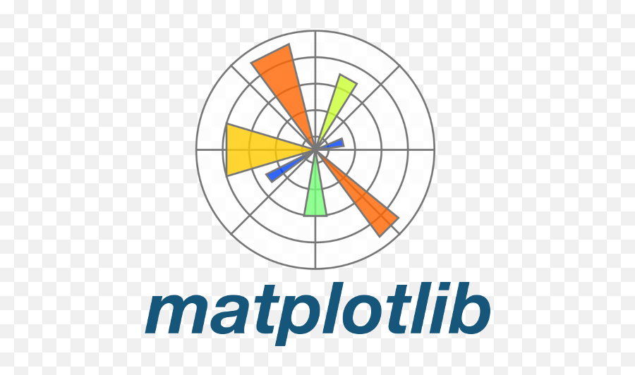

<h1 align='center'>Hello There! I'm Shivam 👋 </h1>
<h2> I am a Data Scientist and a linux enthusiast. I am looking to collabrate on various projects😊. </h2>
<h3> Some More things about me! </h3>
<ul>
  <li> 🧑‍🎓 I am currently a final year student at NIT Hamirpur, India! </li>
  <li> 📊 I do Data Analysis on Kaggle.</li>
  <li> 💪 I enjoy DSA problems and dabble in competitive coding.
  <li> 🕸 I am currently learning web development and web design. </li>
  <li> 🎰 I am looking forward to work on more MLOps Projects.</li>
  <li> 📖 I like Reading and writing in my free time. </li>
  <li> 🪛 I like tinkering with my raspberry pi. </li>
  <li> 💻 I use Arch  btw...</li>
</ul>

<h2 align='center'> We can connect using: </h2>
<a href='https://www.linkedin.com/in/shivam-sagar-aa084820b/'> 
&nbsp
&nbsp
<a href='https://www.kaggle.com/shsagar'> 
&nbsp
&nbsp

<h2>Tech Stack</h2>
  

 

  

